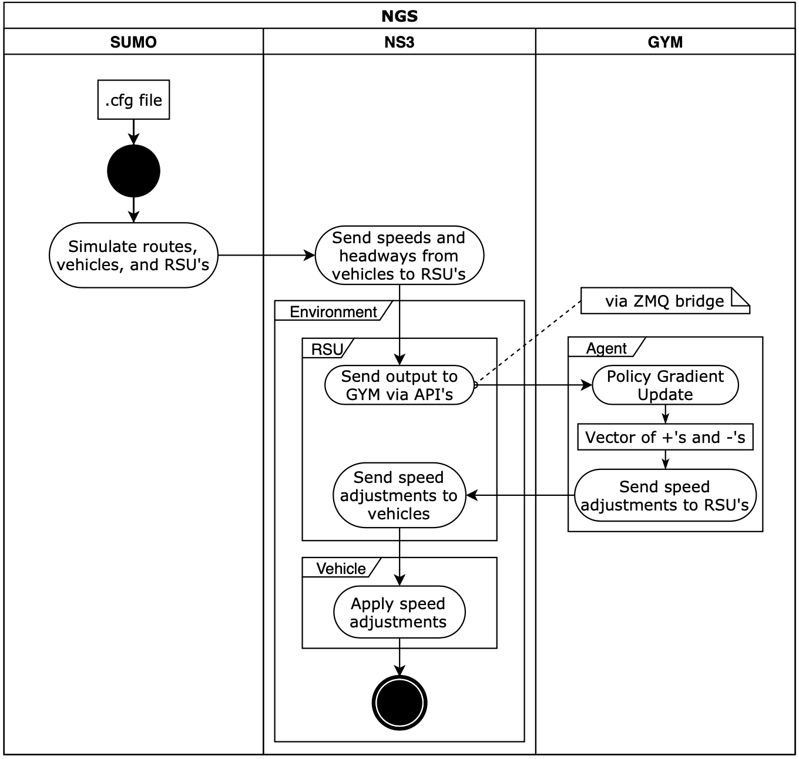

# NGS (ns3 + OpenAI Gym + SUMO)

Welcome to NGS, an augmented version of the repository originally developed by [tkn-tub](https://github.com/tkn-tub/ns3-gym). 

In this augmented version we have managed to additionally integrate the SUMO traffic simulator. Hence all SUMO traffic scenarios are also supported.

Additionally, we performed all of our reinforcement learning using the agents present in the [stable-baselines](https://github.com/hill-a/stable-baselines) repository. Which is a repository with high-quality implementations of well known Deep RL algorithms.

Continuing to scroll down, you will find the three different subsections that will explains the required dependencies for:
* SUMO
* Stable Baselines
* ns3-gym

**Note**: You can go through the steps below for a more hands on installation process or you can run the installation helper script by entering the following command in the terminal:
```bash
./install_dep
```

The above command must be run the working directory of ns3-gym.

## Run simple traffic simulation
```bash
# The following two commands are needed only
# if this is the first time running
# ------------------------------------------ 
./waf configure --enable-examples
./waf build
# ------------------------------------------
# 0 = osm scenario
# 1 = one lane highway
# 2 = two lane highway
# 3 = square scenario
./launch_sumo scenario=[ 0 | 1 | 2 | 3 ]
```

## Train a traffic agent
#### Speed Control
You must have two terminal windows open to perform the following:

Terminal 1 (ns3 side): 
```bash
# This should be run the main working directory
./launch_sumo scenario=[ 0 | 1 | 2 | 3 ]
```

Terminal 2 (gym side):
```bash
# This should be run under rl_fyp/gym_rsu
python3 script.py train online [ alg_name ] scenario=[name] [ policy_kwargs ]
```

#### Lane Changing (Added)
If you also want to train the agent to learn a strategic lane changing
policy then open a third terminal and run the following command:

Terminal 3 (gym side):
```bash
# This should be run under rl_fyp/gym_rsu
python3 script.py train online [ alg_name ] scenario=[name] [ policy_kwargs ]
```

## NGS UML Diagram


Below you can find a UML diagram giving a high level explanation of how NGS works:



---
### SUMO

["Simulation of Urban MObility" (SUMO)](https://sumo.dlr.de/) is an open source,
highly portable, microscopic traffic simulation package designed to handle
large road networks and different modes of transport.

It is mainly developed by employees of the [Institute of Transportation Systems
at the German Aerospace Center](https://www.dlr.de/ts).

---

### Stable Baselines

Stable Baselines is a set of improved implementations of reinforcement learning algorithms based on OpenAI [Baselines](https://github.com/openai/baselines/).

---

### ns3-gym

[OpenAI Gym](https://gym.openai.com/) is a toolkit for reinforcement learning (RL) widely used in research. The network simulator [ns–3](https://www.nsnam.org/) is the de-facto standard for academic and industry studies in the areas of networking protocols and communication technologies. ns3-gym is a framework that integrates both OpenAI Gym and ns-3 in order to encourage usage of RL in networking research.

---

### Contact

* American University of Beirut:
    * **Rayyan Nasr**: rrn13@mail.aub.edu
    * **Jihad Eddine Al Khurfan**: jia07@mail.aub.edu
    * **Ahmad Abou Adla**: aka38@mail.aub.edu
    
---
    
### How to reference the original ns3-gym?

Please use the following bibtex :

```
@inproceedings{ns3gym,
  Title = {{ns-3 meets OpenAI Gym: The Playground for Machine Learning in Networking Research}},
  Author = {Gaw{\l}owicz, Piotr and Zubow, Anatolij},
  Booktitle = {{ACM International Conference on Modeling, Analysis and Simulation of Wireless and Mobile Systems (MSWiM)}},
  Year = {2019},
  Location = {Miami Beach, USA},
  Month = {November},
  Url = {http://www.tkn.tu-berlin.de/fileadmin/fg112/Papers/2019/gawlowicz19_mswim.pdf}
}
```
